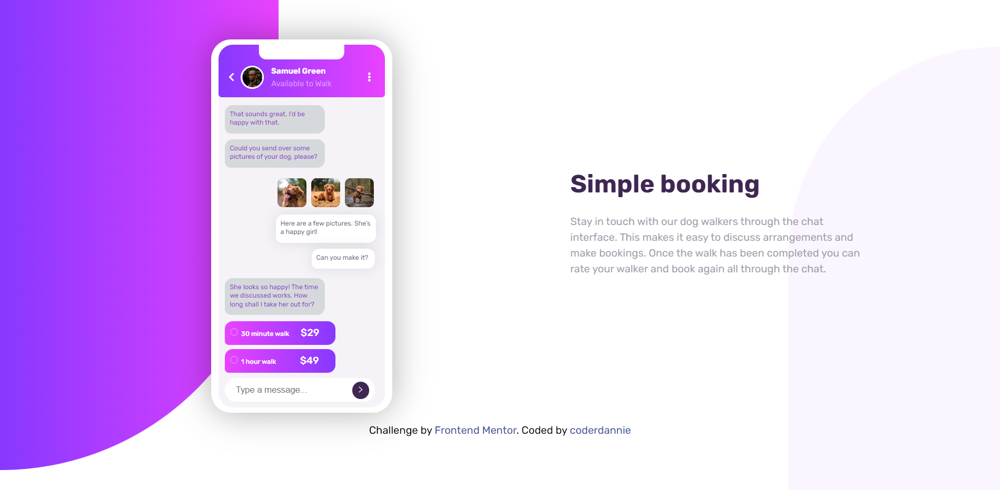

# Frontend Mentor - Chat app CSS illustration solution

This is a solution to the [Chat app CSS illustration challenge on Frontend Mentor](https://www.frontendmentor.io/challenges/chat-app-css-illustration-O5auMkFqY). Frontend Mentor challenges help you improve your coding skills by building realistic projects.

## Table of contents

- [Overview](#overview)
  - [The challenge](#the-challenge)
  - [Screenshot](#screenshot)
  - [Links](#links)
- [My process](#my-process)
  - [Built with](#built-with)
- [Author](#author)

## Overview

### The challenge

Users should be able to:

- View the optimal layout for the component depending on their device's screen size
- **Bonus**: See the chat interface animate on the initial load

### Screenshot

### Links

- Solution URL: [Click here](https://www.frontendmentor.io/solutions/chat-app-illustrustion-OWqls5xfU8)
- Live Site URL: [Click here](https://chat-app-coderdannie.netlify.app/)

## My process

### Built with

- Semantic HTML5 markup
- CSS custom properties
- Flexbox
- CSS Grid
- Mobile-first workflow
- SCSS

## What I learned

My greatest challenge while building this project is positioning elements in the right place without negatively affecting the site's responsiveness. it took some time before I was able to make the site responsive.
Am not really good at CSS animation yet and I hope the little that I could add makes sense. I learnt how to position element in css

## Author

- Frontend Mentor - [Frontend Mentor](https://www.frontendmentor.io/profile/coderdannie)
- Twitter - [Twitter](https://www.twitter.com/coderdannie)
